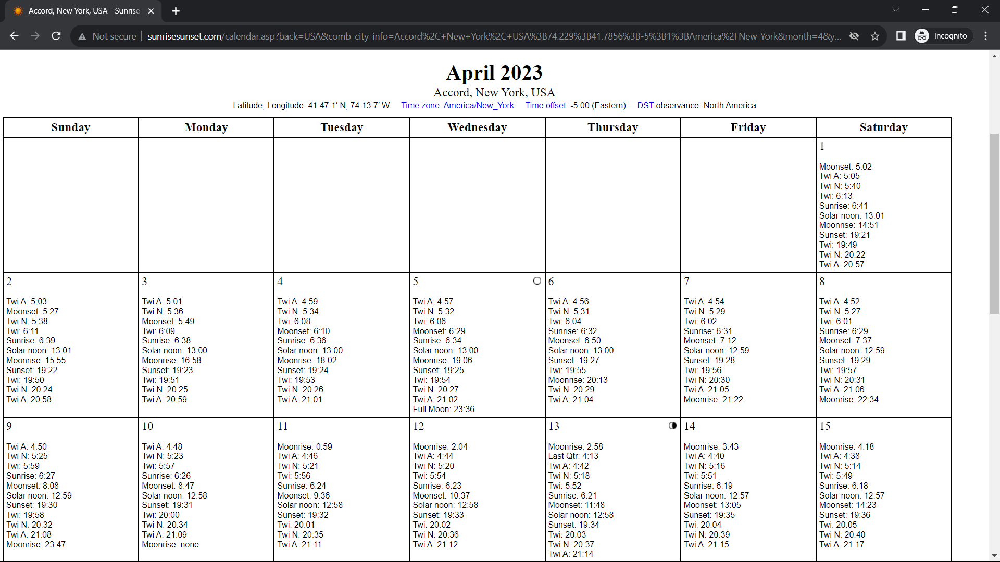
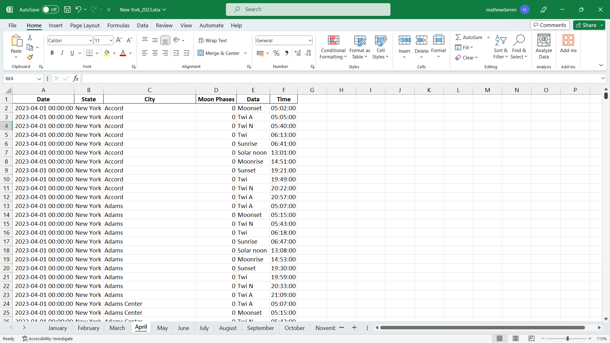

# Scraping U.S. Sunrise and Sunset Calendars

This project was commissioned by a client. If you're interested in similar work, check out my freelance data analyst profile on [Fastwork](https://fastwork.id/user/darren7753).

## Objective
The aim of this project was to scrape sunrise and sunset data for 27 states (from Nebraska to Wyoming) in the U.S. from http://sunrisesunset.com/USA/. Here's a breakdown:
- **States**: Nebraska to Wyoming.
- **Cities**: All cities within each state.
- **Timeline**: January 2022 to April 2023.
- **Output**: For each state, data is saved in two Excel files per year. For instance, New York's data is available in `New York_2022.xlsx` and `New York_2023.xlsx`. Within each file, individual months are represented as separate sheets detailing every city's sunrise and sunset times.

## Implementation
For the scraping process, I combined popular libraries like BeautifulSoup and Selenium. Considering the volume of data, local execution would be inefficient. Hence, I employed GitHub Actions to automate and run the task on the GitHub server. The process is divided into:
- `scraping_calendar_urls.py`
  - This script fetches calendar links for every city in every state. Since each city has uniform links differing only by month and year (e.g., for January it appends `month=1`, for February `month=2`, etc.), I optimized by scraping only January 2022 links.
  - All the links are saved to `calendar_urls.txt`. As earlier mentioned, since the file only accounts for January 2022, I looped through each link, adding entries for other months and years. All full calendar links are then stored in `modified_urls.txt`.
  - This step executes via GitHub Actions, facilitated by the `scraping_calendar_urls.yml` file.
- `scraping_data_V2.py`
  - This script processes all calendar links in `modified_urls.txt`. However, given that the file contains over 200,000 links, it would surpass GitHub Actions' 6-hour limit. To address this, I scraped in batches of 10. After each batch, a new workflow initiates to handle the next set.
  - To further optimize, I employed ThreadPoolExecutor for parallel processing. To avoid conflicts, each thread assigns a unique ID to the saved file (e.g., `New York_2022_id=c37a4da3-566b-4894-b76a-d310f2ea8e76.xlsx`).
  - Occasionally, errors might occur for various reasons. Faulty links are saved in the `Error_V2` folder, while successful scrapes go into the `Data_V2` folder. Any errors are addressed manually with results stored in `Retry_Data_V2`.
  - This step executes via GitHub Actions, facilitated by the `scraping_data_V2.yml` file.
- `cleaning_data.py`
  - This script cleans and consolidates the data per state and year (e.g., `New York_2022.xlsx`, `New York_2023.xlsx`, etc.).
 

You can view all the collected data in this [Drive](https://drive.google.com/drive/folders/1Vx_xGYt3jTfDB2vFhAz-KKvUgIZDZVws?usp=sharing) folder. As an example, the datasets for New York (both pre and post-scraping) can be seen in the following:
<table align="center">
  <tr>
    <td align="center">
        
         
        <em>Pre-scraping for New York</em>
    </td>
    <td align="center">
        
         
        <em>Post-scraping for New York</em>
    </td>
  </tr>
</table>

Thank you for reviewing this repository. Please don't hesitate to reach out for further information or collaboration opportunities.
